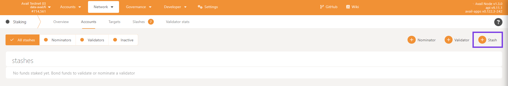
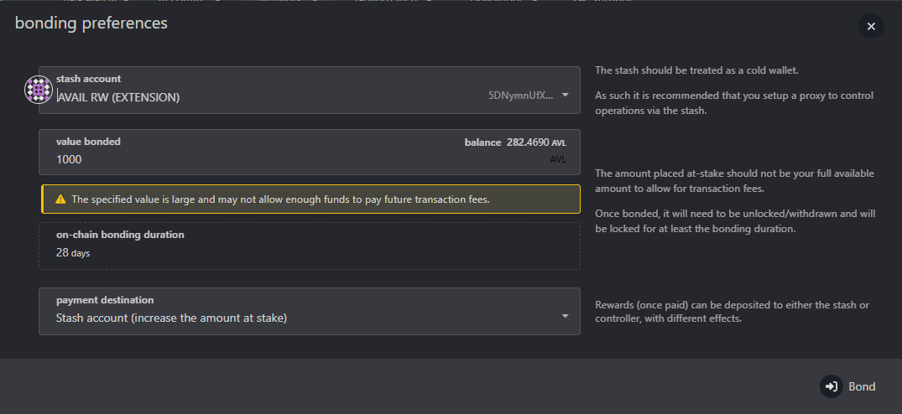
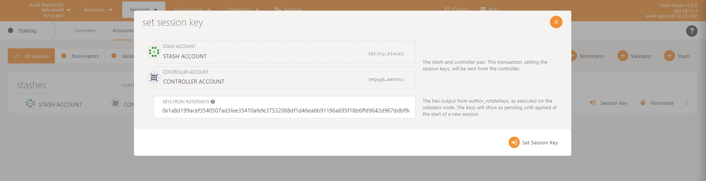
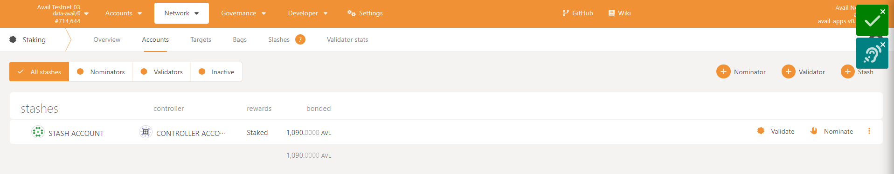
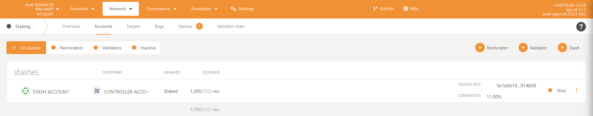

# Run Full Node and Validator Avail Docker v1.8.0.4
<p align="center">
  
</p>

## Recommended Hardware Requirements 


## Option 1 (Automatic)
```
cd $HOME && curl -o avail-auto.sh https://raw.githubusercontent.com/vnbnode/binaries/main/Projects/Avail/avail-auto.sh && bash avail-auto.sh
```
## Option 2 (Manual)

### Install Docker
```
sudo apt-get update
sudo apt-get install \
ca-certificates \
curl \
gnupg
sudo install -m 0755 -d /etc/apt/keyrings
curl -fsSL https://download.docker.com/linux/ubuntu/gpg | sudo gpg --dearmor -o /etc/apt/keyrings/docker.gpg
sudo chmod a+r /etc/apt/keyrings/docker.gpg
echo \
"deb [arch="$(dpkg --print-architecture)" signed-by=/etc/apt/keyrings/docker.gpg] https://download.docker.com/linux/ubuntu \
"$(. /etc/os-release && echo "$VERSION_CODENAME")" stable" | \
sudo tee /etc/apt/sources.list.d/docker.list > /dev/null
sudo apt-get update
sudo apt-get install docker-ce docker-ce-cli containerd.io docker-buildx-plugin docker-compose-plugin
```

### 1/ Pull image new 
```
docker pull availj/avail:v1.8.0.4
```
### 2/ Run node
```
docker run --network host -v ./node-data/:/da/node-data availj/avail:v1.8.0.4 --chain goldberg --name <Fill name Validator> --validator -d /da/node-data
```
### 3/ Rename container
```
docker rename name_old avail
```
### 4/ Check log node
```
docker logs avail -f
```
## Create Validator
1. Navigate to the Goldberg network explorer at http://goldberg.avail.tools.
* Note: `Need 1000 AVL to create Validator`
2. Navigate to the `Staking` tab in the Explorer



3. Fill in the bonding preferences:
- Value bonded: `1000`
- Payment destination: `Stash account` 
- Select `Bond`


- Select: `Sign and Submit`


4. Add Sessions Keys

Using Binaries:
```
curl -H "Content-Type: application/json" -d '{"id":1, "jsonrpc":"2.0", "method": "author_rotateKeys", "params":[]}' http://localhost:9944
```
5. Navigate back to the Staking tab click on `Set Session Key` and enter the hex-encoded result



6. Click `Validate` on the `Staking` tab


- Set your validator commission percentage
- Click `Validate`
7. DONE



### *Follow the instruction from project:* [Guide](https://docs.availproject.org/operate/validator/staking/)

## Update new version

### 1/ Stop node
```
docker stop avail
```
### 2/ Remove node
```
docker rm avail
```
### 3/ Update new version
```
docker pull availj/avail:v1.8.0.4
```
### 4/ Run node
```
docker run --network host -v ./node-data/:/da/node-data availj/avail:v1.8.0.4 --chain goldberg --name <Fill name Validator> --validator -d /da/node-data
```
### 5/ Rename container
```
docker rename name_old avail
```
### 6/ Check log node
```
docker logs avail -f
```
## Thank to support VNBnode.
### Visit us at:

 <a href="https://t.me/VNBnodegroup" target="_blank">VNBnodegroup</a>

 <a href="https://t.me/Vnbnode" target="_blank">VNBnode News</a>

 <a href="https://VNBnode.com" target="_blank">VNBnode.com</a>

