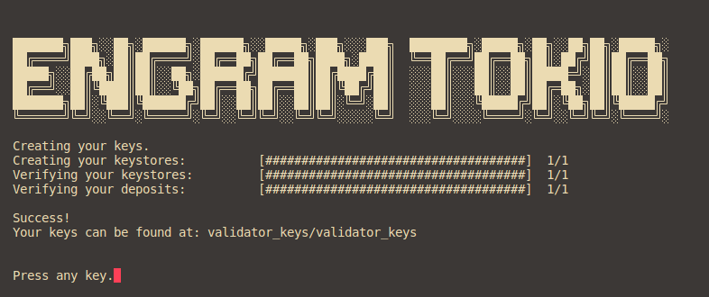
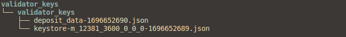

# Run Node Engram

## Option 1: Automatic

## Option 2: Manual
## I\. Run Node
### 1\. Update
```
sudo apt update && sudo apt upgrade -y
```

### 2\. Package
```
sudo apt install curl tar wget clang pkg-config protobuf-compiler libssl-dev jq build-essential protobuf-compiler bsdmainutils git make ncdu gcc git jq chrony liblz4-tool -y
```

### 3\. Install Docker
```
sudo apt-get update
sudo apt-get install \
ca-certificates \
curl \
gnupg
sudo install -m 0755 -d /etc/apt/keyrings
curl -fsSL https://download.docker.com/linux/ubuntu/gpg | sudo gpg --dearmor -o /etc/apt/keyrings/docker.gpg
sudo chmod a+r /etc/apt/keyrings/docker.gpg
echo \
"deb [arch="$(dpkg --print-architecture)" signed-by=/etc/apt/keyrings/docker.gpg] https://download.docker.com/linux/ubuntu \
"$(. /etc/os-release && echo "$VERSION_CODENAME")" stable" | \
sudo tee /etc/apt/sources.list.d/docker.list > /dev/null
sudo apt-get update
sudo apt-get install docker-ce docker-ce-cli containerd.io docker-buildx-plugin docker-compose-plugin
```

### 4\. SETUP
```
git clone --recursive https://github.com/engram-network/tokio-docker.git && cd tokio-docker && chmod +x ./scripts/*.sh && bash ./scripts/init-dependency.sh && mkdir -p execution consensus validator
```

### 5\. Edit file `docker-compose.yml`
```
nano docker-compose.yml
```
```
identity=avenbreaks << Replace with your discord username (e.g: avenbreaks. don't add your hastag discord user)
enr-address=0.0.0.0 << Replace with your public IPAddress
graffiti=engram-labs << Replace with your unique name
```

### 6\. Run
```
docker compose up -d
```
You will see the following:
```
$ docker compose up -d
[+] Running 4/4
 ⠿ Network tokio_default_default                           Created
 ⠿ Container striatum_init                                 Started
 ⠿ Container striatum_el                                   Started
 ⠿ Container lighthouse_cl                                 Started
```

### 7\. Check logs
```
docker logs striatum_el -f
```
- see on striatum_el:
```
INFO [09-26|19:28:45.046] Forkchoice requested sync to new head    number=30729 hash=a38be3..648659 finalized=30652
INFO [09-26|19:28:57.045] Forkchoice requested sync to new head    number=30730 hash=eb3642..45f557 finalized=30652
INFO [09-26|19:29:09.046] Forkchoice requested sync to new head    number=30731 hash=b9fd32..3748bd finalized=30652
INFO [09-26|19:29:21.046] Forkchoice requested sync to new head    number=30732 hash=51ff7b..803756 finalized=30652
INFO [09-26|19:29:33.046] Forkchoice requested sync to new head    number=30733 hash=f80ac7..19e5f7 finalized=30652
```
```
docker logs lighthouse_cl -f
```
- see on lighthouse_cl:
```
INFO Subscribed to topics
INFO Sync state updated      new_state: Evaluating known peers, old_state: Syncing Finalized Chain, service: sync
INFO Sync state updated      new_state: Syncing Head Chain, old_state: Evaluating known peers, service: sync
INFO Sync state updated      new_state: Synced, old_state: Syncing Head Chain, service: sync
INFO Subscribed to topics    topics: ["/eth2/9c4e948f/bls_to_execution_change/ssz_snappy"]
```

## II\. Engram Network Validator Node Setup
```
nano ./scripts/validator-deposit-data.sh
```
```
amount: The amount of tGRAM to deposit (e.g., 32000000000)
smin: source min value (e.g., 0)
smax: source max value (e.g., 1)
withdrawals-mnemonic: your mnemonic phrase from generate eth2-val-tools.
validators-mnemonic: your mnemonic phrase from generate eth2-val-tools.
from: address that was already funded from the faucet.
privatekey: your privatekey address that has funds from the faucet.
```
```
./scripts/validator-deposit-data.sh
```

- wait until the script executes the deposit data. if the deposit is successful you will get the file: `testnet_deposit_0_1.json`

## III\. Creating Keystore

```
./scripts/run-key.sh
```
wait for docker to bring up the interface to create a keystore deposit.
```
Using the tool on an offline and secure device is highly recommended to keep your mnemonic safe.

Please choose your language ['1. العربية', '2. ελληνικά', '3. English', '4. Français', '5. Bahasa melayu', '6. Italiano', '7. 日本語', '8. 한국어', '9. Português do Brasil', '10. român', '11. Türkçe', '12. 简体中文']: [English]: english
```
```
Please repeat the index to confirm: 0

Please enter your mnemonic separated by spaces (" "). Note: you only need to enter the first 4 letters of each word if you'd prefer.: enter mnemonic from generating eth2-val-tools
```
```
Please choose the (mainnet or testnet) network/chain name ['mainnet', 'goerli', 'sepolia', 'zhejiang', 'holesky', 'engram', 'mainnet']: engram
```
```
Create a password that secures your validator keystore(s). You will need to re-enter this to decrypt them when you setup your Ethereum validators.: 
```
! Create a password that is easy to remember. this will refer to importing the keystore in the lighthouse client.

Once you have completed the step of creating a keystore deposit, it will look like this:
```
Creating your keys.
Creating your keystores:          [####################################]  1/1
Verifying your keystores:         [####################################]  1/1
Verifying your deposits:          [####################################]  1/1

Success!
Your keys can be found at: validator_keys/validator_keys
```




## IV\. Running Validator Node
```
$ docker inspect lighthouse_cl | grep "IPAddress"
  "IPAddress": "172.30.0.3",
```
Copy the IPAddress of the `lighthouse_cl` container and change the docker-compose-validator.yml section 
```
--beacon-nodes=http://CHANGE_IPAddress:5052
--suggested-fee-recipient=CHANGE_WITH_YOUR_ADDRESS
--graffiti=CHANGE_WITH_YOUR_DISCORD_USER_WITHOUT_HASHTAG
```
```
docker compose -f docker-compose-validator.yml up -d
```


! Making a deposit takes time for the protocol to receive and validate your deposit data and keystore, it takes at least 18-46 hours (estimation only) for the protocol to completely validate your data.