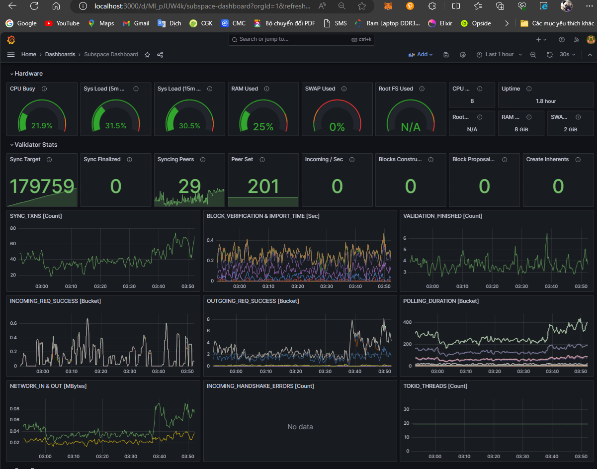
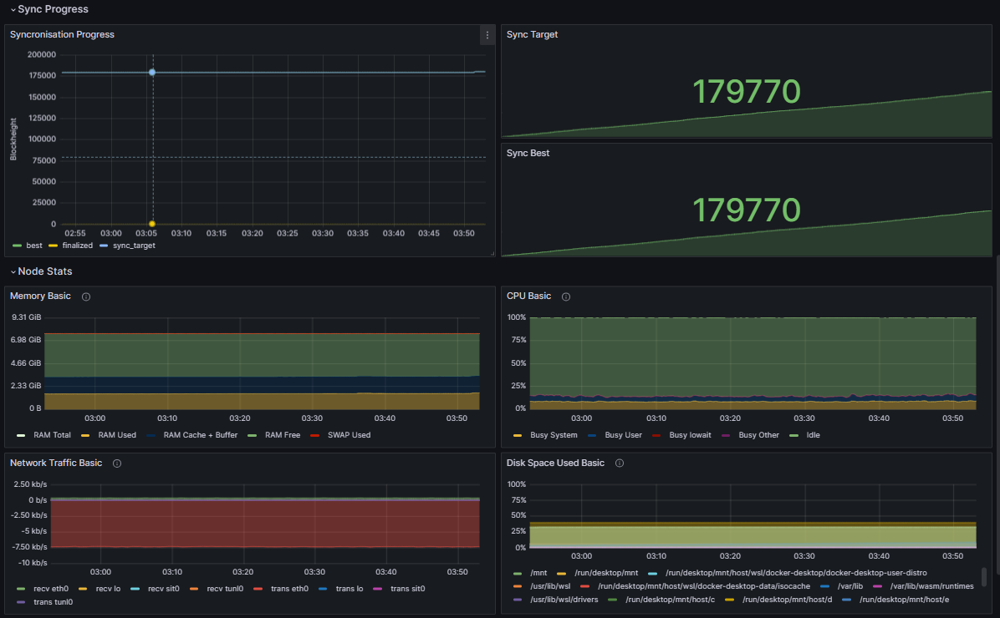

# Run Node Subspace

## Recommended Hardware Requirements 

|   SPEC      |        Recommend          |
| :---------: | :-----------------------: |
|   **CPU**   | 4 Cores (ARM64 or x86-64) |
|   **RAM**   |        8 GB (DDR4)        |
|   **SSD**   |        100 GB             |
| **NETWORK** |        100 Mbps           |

### 1\. Download docker-compose.yml
```

```

### Monitor
```
cd $HOME && wget https://raw.githubusercontent.com/vnbnode/VNBnode-Guides/main/Subspace/Monitor/monitor.sh && bash monitor.sh
```
- Login
```
IP:3000
```
- User | Password
```
user: admin
pass: MFL123123
```



## Thank to support VNBnode.
### Visit us at:

 <a href="https://t.me/VNBnodegroup" target="_blank">VNBnodegroup</a>

 <a href="https://t.me/Vnbnode" target="_blank">VNBnode News</a>

 <a href="https://VNBnode.com" target="_blank">VNBnode.com</a>