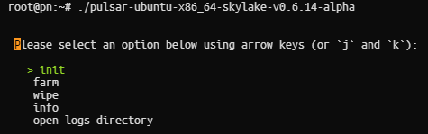

# Run Node Subspace

## Recommended Hardware Requirements 

|   SPEC      |        Recommend          |
| :---------: | :-----------------------: |
|   **CPU**   | 4 Cores (ARM64 or x86-64) |
|   **RAM**   |        8 GB (DDR4)        |
|   **SSD**   |        100 GB             |
| **NETWORK** |        100 Mbps           |

## Option 1: Pulsar
- Create Folder `sub`
```
cd $HOME && mkdir sub && mkdir farm && chmod +x -R farm && cd sub 
```
### [Download the latest Releases here](https://github.com/subspace/pulsar/releases)
#### NOTE:
- CPU from 2015 or later: `skylake`
- CPU from 2015 or earlier: `v2`


- Example CPU from 2015 or later: `skylake` 
```
wget https://github.com/subspace/pulsar/releases/download/v0.6.14-alpha/pulsar-ubuntu-x86_64-skylake-v0.6.14-alpha
```
- Example CPU from 2015 or earlier: `v2`
```
wget https://github.com/subspace/pulsar/releases/download/v0.6.14-alpha/pulsar-ubuntu-x86_64-v2-v0.6.14-alpha
```
- Grant permission to open the file
```
chmod +x pulsar-ubuntu-x86_64-skylake-v0.6.14-alpha

chmod +x pulsar-ubuntu-x86_64-v2-v0.6.14-alpha
```
- Obligatory rename file:
```
mv $HOME/sub/pulsar-ubuntu-x86_64-skylake-v0.6.14-alpha pulsar

mv $HOME/sub/pulsar-ubuntu-x86_64-v2-v0.6.14-alpha pulsar
```
### Run Node
```
./pulsar
```


#### Step 1: Select init

#### Step 2: Select farm

## Option 2: Manual
- Create Folder `sub`
```
cd $HOME && mkdir sub && cd sub 
```
### [Download the latest Releases here](https://github.com/subspace/subspace/releases)
### NOTE:
- CPU from 2015 or later: `skylake`
- CPU from 2015 or earlier: `v2`
### `Node`


### `Farm`


- Example CPU from 2015 or later: `skylake` 
```
wget https://github.com/subspace/subspace/releases/download/gemini-3g-2023-nov-21/subspace-node-ubuntu-x86_64-skylake-gemini-3g-2023-nov-21

wget https://github.com/subspace/subspace/releases/download/gemini-3g-2023-nov-21/subspace-farmer-ubuntu-x86_64-skylake-gemini-3g-2023-nov-21
```
- Example CPU from 2015 or earlier: `v2`
```
wget https://github.com/subspace/subspace/releases/download/gemini-3g-2023-nov-21/subspace-node-ubuntu-x86_64-v2-gemini-3g-2023-nov-21

wget https://github.com/subspace/subspace/releases/download/gemini-3g-2023-nov-21/subspace-farmer-ubuntu-x86_64-v2-gemini-3g-2023-nov-21
```
- Grant permission to open the file
```
chmod +x subspace-node-ubuntu-x86_64-skylake-gemini-3g-2023-nov-21

chmod +x subspace-farmer-ubuntu-x86_64-skylake-gemini-3g-2023-nov-21
```
- Obligatory rename file:
```
mv $HOME/sub/subspace-node-ubuntu-x86_64-skylake-gemini-3g-2023-nov-21 node

mv $HOME/sub/subspace-farmer-ubuntu-x86_64-skylake-gemini-3g-2023-nov-21 farm
```
### Create SystemD
- Node
```
nano /etc/systemd/system/node.service
```
```
[Unit]
Description=Subspace Node
After=network.target

[Service]
Type=simple
User=root
Environment=NAME_PREFIX=VNBnode
Environment=NODES_DIR=$HOME/sub/
Environment=NODE_BIN=$HOME/sub/node
ExecStart=/bin/bash -c 'exec ${NODE_BIN} \
    --chain gemini-3g \
    --base-path ${NODES_DIR}\
    --blocks-pruning 256 \
    --port 30333 \
    --state-pruning archive-canonical \
    --no-private-ipv4 \
    --dsn-listen-on /ip4/0.0.0.0/udp/30433/quic-v1 \
    --dsn-listen-on /ip4/0.0.0.0/tcp/30433 \
    --rpc-cors all \
    --rpc-methods unsafe \
    --rpc-external \
    --prometheus-external \
    --prometheus-port 9615 \
    --validator \
    --name ${NAME_PREFIX}'
KillSignal=SIGINT
LimitNOFILE=10000
Restart=on-failure
RestartSec=10
Nice=-5

[Install]
WantedBy=multi-user.target
```

- Farm
```
nano /etc/systemd/system/farm.service
```
```
[Unit]
Description=Subspace Farm
After=network.target

[Service]
Type=simple
User=root
Environment=NODE_BIN=$HOME/sub/farm
ExecStart=/bin/bash -c 'exec ${NODE_BIN} \
    farm path=/farm,size=100G \
    --reward-address stxxxxxxxxxxx'
KillSignal=SIGINT
LimitNOFILE=10000
Restart=on-failure
RestartSec=10
Nice=-5

[Install]
WantedBy=multi-user.target
```
- Run Node & Farm
```
sudo systemctl daemon-reload
sudo systemctl enable node
sudo systemctl start node
sudo systemctl enable farm
sudo systemctl start farm
```
### Check logs 
```
journalctl -fu node -o cat
```
```
journalctl -fu farm -o cat
```
### Monitor
```
cd $HOME && wget https://raw.githubusercontent.com/vnbnode/VNBnode-Guides/main/Subspace/Monitor/monitor.sh && bash monitor.sh
```
- Login
```
IP:3000
```
- User | Password
```
user: admin
pass: MFL123123
```


## Thank to support VNBnode.
### Visit us at:

 <a href="https://t.me/VNBnodegroup" target="_blank">VNBnodegroup</a>

 <a href="https://t.me/Vnbnode" target="_blank">VNBnode News</a>

 <a href="https://VNBnode.com" target="_blank">VNBnode.com</a>
